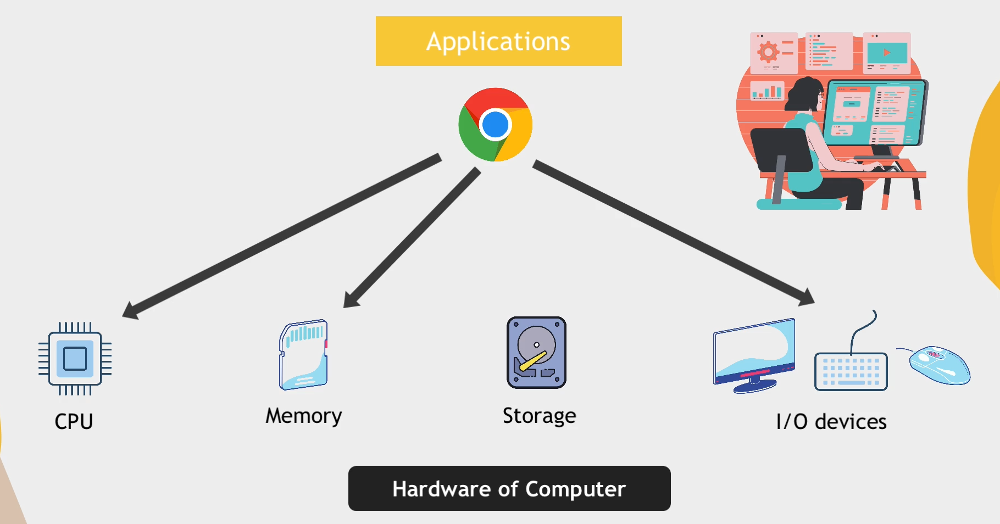
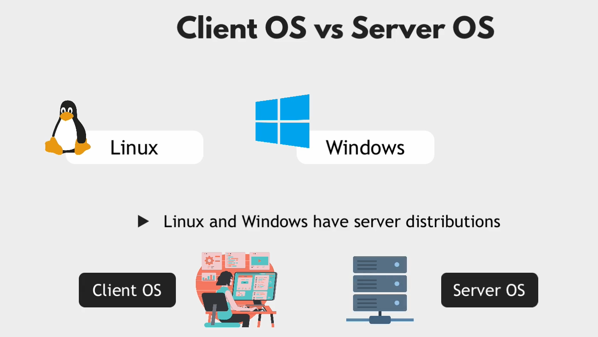
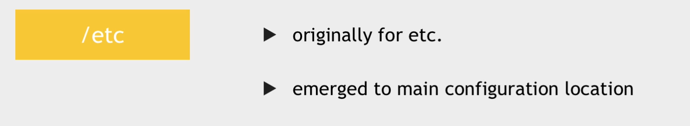
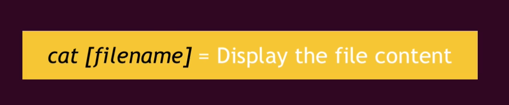
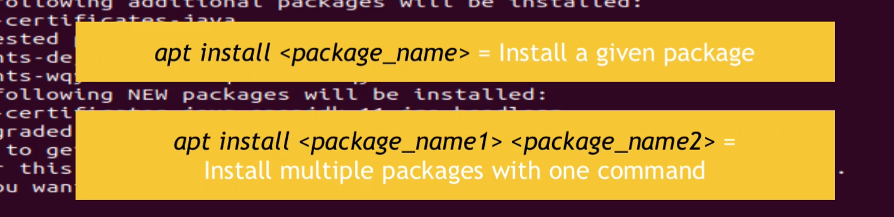
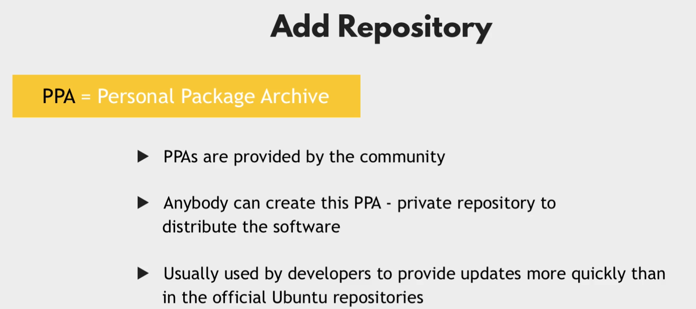
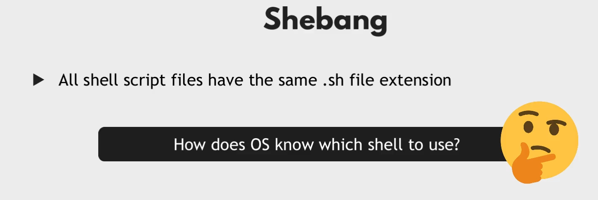
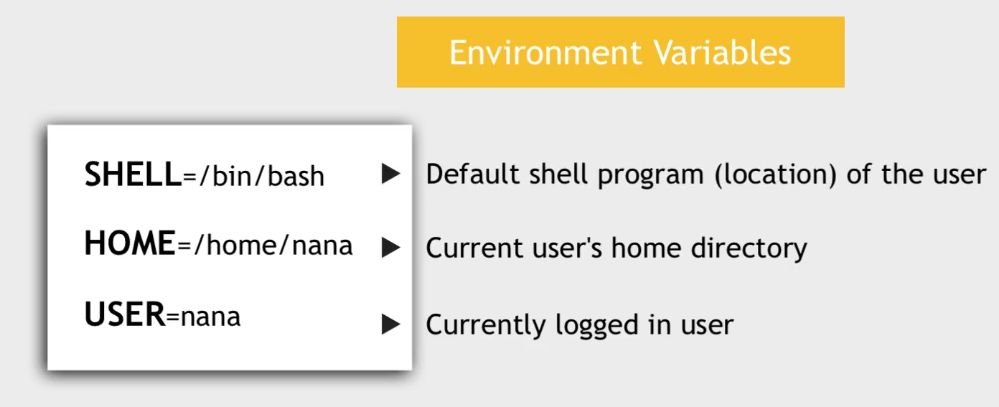

# DevOps Bootcamp


- [DevOps Bootcamp](#devops-bootcamp)
  - [1 - Bootcamp Overview + Tools Installation Checklist](#1---bootcamp-overview--tools-installation-checklist)
    - [Concepts and hands-on Demos](#concepts-and-hands-on-demos)
    - [Pipeline](#pipeline)
    - [Tools](#tools)
    - [Checklist](#checklist)
  - [2 - Introduction to DevOps](#2---introduction-to-devops)
    - [Concepts](#concepts)
    - [Demos](#demos)
  - [0 - Module Intro + Checklist](#0---module-intro--checklist)
  - [1 - Introduction to Operating Systems](#1---introduction-to-operating-systems)
  - [2 - Introduction to Virtualization \& Virtual Machines](#2---introduction-to-virtualization--virtual-machines)
  - [3 - Setup a Linux Virtual Machine](#3---setup-a-linux-virtual-machine)
  - [4 - Linux File System](#4---linux-file-system)
  - [5 - Introduction to Command Line Interface (CLI - Part 1)](#5---introduction-to-command-line-interface-cli---part-1)
  - [6 - Basic Linux Commands (CLI - Part 2)](#6---basic-linux-commands-cli---part-2)
  - [7 - Package Manager - Installing Software on Linux](#7---package-manager---installing-software-on-linux)
  - [8 - Working with Vim Editor](#8---working-with-vim-editor)
  - [9 - Linux Accounts \& Groups (Users \& Permissions Part 1)](#9---linux-accounts--groups-users--permissions-part-1)
  - [10 - File Ownership \& Permissions (Users \& Permissions - Part 2)](#10---file-ownership--permissions-users--permissions---part-2)
  - [11 - Basic Linux Commands - Pipes \& Redirects (CLI - Part 3)](#11---basic-linux-commands---pipes--redirects-cli---part-3)
  - [12 - Introduction to Shell Scripting Part 1](#12---introduction-to-shell-scripting-part-1)
  - [13 - Shell Scripting Part 2 - Concepts \& Syntax](#13---shell-scripting-part-2---concepts--syntax)
  - [14 - Shell Scripting Part 3 - Concepts \& Syntax](#14---shell-scripting-part-3---concepts--syntax)
  - [15 - Environment Variables](#15---environment-variables)
    - [what is an environment variable](#what-is-an-environment-variable)
    - [command to print all the environment variables](#command-to-print-all-the-environment-variables)
  - [16 - Networking](#16---networking)
  - [17 - SSH - Secure Shell](#17---ssh---secure-shell)
  - [0 - Module Intro + Checklist](#0---module-intro--checklist-1)
  - [1 - Introduction to Version Control and Git](#1---introduction-to-version-control-and-git)
  - [2 - Basic Concepts of Git](#2---basic-concepts-of-git)
  - [3 - Setup Git Repository Remote and Local](#3---setup-git-repository-remote-and-local)
  - [4 - Working with Git](#4---working-with-git)
  - [5 - Initialize a Git project locally](#5---initialize-a-git-project-locally)
  - [6 - Concept of Branches](#6---concept-of-branches)
  - [7 - Merge Requests](#7---merge-requests)
  - [8 - Deleting Branches](#8---deleting-branches)
  - [9 - Rebase](#9---rebase)
  - [10 - Resolving Merge Conflicts](#10---resolving-merge-conflicts)
  - [11 - Gitignore](#11---gitignore)
  - [12 - Git stash](#12---git-stash)
  - [13 - Going back in history](#13---going-back-in-history)
  - [14 - Undoing commits](#14---undoing-commits)
  - [15 - Merging branches](#15---merging-branches)
  - [16 - Git for Devops](#16---git-for-devops)
  - [1 - Databases in development process](#1---databases-in-development-process)
  - [2 - Database Types](#2---database-types)
  - [0 - Module Intro + Checklist](#0---module-intro--checklist-2)
  - [1 - Introduction to Build Tools](#1---introduction-to-build-tools)
  - [2 - Install Build Tools](#2---install-build-tools)
  - [3 - Installation Help for Windows User - Part 1](#3---installation-help-for-windows-user---part-1)
  - [4 - Installation Help for Windows User - Part 2](#4---installation-help-for-windows-user---part-2)
  - [5 - Installation Help for MacOS-Unix User](#5---installation-help-for-macos-unix-user)
  - [6 - Build an Artifact](#6---build-an-artifact)
  - [7 - Build Tools for Development](#7---build-tools-for-development)
  - [8 - Run the Application](#8---run-the-application)
  - [9 - Build JS Applications](#9---build-js-applications)
  - [10 - Common Concepts and Differences of Build Tools](#10---common-concepts-and-differences-of-build-tools)
  - [11 - Publish an Artifact](#11---publish-an-artifact)
  - [12 - Build Tools \& Docker](#12---build-tools--docker)
  - [13 - Build Tools for DevOps](#13---build-tools-for-devops)
  - [0 - Module Intro + Checklist](#0---module-intro--checklist-3)
  - [1 - Intro to Cloud \& IaaS](#1---intro-to-cloud--iaas)
  - [2 - Setup Server on DigitalOcean](#2---setup-server-on-digitalocean)
  - [3 - Deploy and run application artifact on Droplet](#3---deploy-and-run-application-artifact-on-droplet)
  - [4 - Create and configure a Linux user on a cloud server](#4---create-and-configure-a-linux-user-on-a-cloud-server)
  - [0 - Module Intro + Checklist](#0---module-intro--checklist-4)
  - [1 - Intro to Artifact Repository Manager](#1---intro-to-artifact-repository-manager)
  - [2 - Install and Run Nexus on a cloud server](#2---install-and-run-nexus-on-a-cloud-server)
  - [3 - Introduction to Nexus](#3---introduction-to-nexus)
  - [4 - Repository Types](#4---repository-types)
  - [5 - Publish Artifact to Repository](#5---publish-artifact-to-repository)
  - [6 - Nexus REST API](#6---nexus-rest-api)
  - [7 - Blob Store](#7---blob-store)
  - [8 - Component vs Asset](#8---component-vs-asset)
  - [9 - Cleanup Policies and Scheduled Tasks](#9---cleanup-policies-and-scheduled-tasks)
  - [0 - Module Intro + Checklist](#0---module-intro--checklist-5)
  - [1 - What is a Container](#1---what-is-a-container)
  - [2 - Container vs Image](#2---container-vs-image)
  - [3 - Docker vs. Virtual Machine](#3---docker-vs-virtual-machine)
  - [4 - Docker Architecture and components](#4---docker-architecture-and-components)
  - [5 - Main Docker Commands](#5---main-docker-commands)
  - [6 - Debug Commands](#6---debug-commands)
  - [7 - Docker Demo - Project Overview](#7---docker-demo---project-overview)
  - [8 - Developing with Docker](#8---developing-with-docker)
  - [9 - Docker Compose - Run multiple Docker containers](#9---docker-compose---run-multiple-docker-containers)
  - [10 - Dockerfile - Build your own Docker Image](#10---dockerfile---build-your-own-docker-image)
  - [11 - Private Docker Repository](#11---private-docker-repository)
  - [12 - Deploy docker application on a server](#12---deploy-docker-application-on-a-server)
  - [13 - Docker Volumes - Persisting Data](#13---docker-volumes---persisting-data)
  - [14 - Docker Volumes Demo](#14---docker-volumes-demo)
  - [15 - Create Docker Hosted Repository on Nexus](#15---create-docker-hosted-repository-on-nexus)
  - [16 - Deploy Nexus as Docker Container](#16---deploy-nexus-as-docker-container)
  - [0 - Module Intro + Checklist](#0---module-intro--checklist-6)
  - [1 - Intro to Build Automation](#1---intro-to-build-automation)
  - [2 - Install Jenkins](#2---install-jenkins)
  - [3 - Introduction to Jenkins UI](#3---introduction-to-jenkins-ui)
  - [4 - Install Build Tools in Jenkins](#4---install-build-tools-in-jenkins)
  - [5 - Jenkins Basics Demo - Freestyle Job](#5---jenkins-basics-demo---freestyle-job)
  - [6 - Docker in Jenkins](#6---docker-in-jenkins)
  - [7 - Freestyle to Pipeline Job](#7---freestyle-to-pipeline-job)
  - [8 - Intro to Pipeline Job](#8---intro-to-pipeline-job)
  - [9 - Jenkinsfile Syntax](#9---jenkinsfile-syntax)
  - [10 - Create complete Pipeline](#10---create-complete-pipeline)
  - [11 - Intro to Multibranch Pipeline](#11---intro-to-multibranch-pipeline)
  - [12 - Jenkins Jobs Overview](#12---jenkins-jobs-overview)
  - [13 - Credentials in Jenkins](#13---credentials-in-jenkins)
  - [14 - Jenkins Shared Library](#14---jenkins-shared-library)
  - [15 - Webhooks - Trigger Pipeline Jobs automatically](#15---webhooks---trigger-pipeline-jobs-automatically)
  - [16 - Dynamically Increment Application version in Jenkins Pipeline - Part 1](#16---dynamically-increment-application-version-in-jenkins-pipeline---part-1)
  - [17 - Dynamically Increment Application version in Jenkins Pipeline - Part 2](#17---dynamically-increment-application-version-in-jenkins-pipeline---part-2)
  - [0 - Module Intro + Checklist](#0---module-intro--checklist-7)
  - [1 - Introduction to AWS](#1---introduction-to-aws)
  - [2 - Create an AWS account](#2---create-an-aws-account)
  - [3 - IAM - Manage Users, Roles and Permissions](#3---iam---manage-users-roles-and-permissions)
  - [4 - Regions \& Availability Zones](#4---regions--availability-zones)
  - [5 - VPC - Manage Private Network on AWS](#5---vpc---manage-private-network-on-aws)
  - [6 - CIDR Blocks explained](#6---cidr-blocks-explained)
  - [7 - Introduction to EC2 Virtual Cloud Server](#7---introduction-to-ec2-virtual-cloud-server)
  - [8 - Deploy to EC2 server from Jenkins Pipeline - CI/CD Part 1](#8---deploy-to-ec2-server-from-jenkins-pipeline---cicd-part-1)
  - [9 - Deploy to EC2 server from Jenkins Pipeline - CI/CD Part 2](#9---deploy-to-ec2-server-from-jenkins-pipeline---cicd-part-2)
  - [10 - Deploy to EC2 server from Jenkins Pipeline - CI/CD Part 3](#10---deploy-to-ec2-server-from-jenkins-pipeline---cicd-part-3)
  - [11 - Introduction to AWS CLI](#11---introduction-to-aws-cli)
  - [12 - AWS \& Terraform Preview](#12---aws--terraform-preview)
  - [13 - Container Services on AWS Preview](#13---container-services-on-aws-preview)
  - [0 - Module Intro + Checklist](#0---module-intro--checklist-8)
  - [1 - Intro to Kubernetes](#1---intro-to-kubernetes)
  - [2 - Main Kubernetes Components](#2---main-kubernetes-components)
  - [3 - Kubernetes Architecture](#3---kubernetes-architecture)
  - [4 - Minikube and kubectl - Local Kubernetes Cluster](#4---minikube-and-kubectl---local-kubernetes-cluster)
  - [5 - Main kubectl commands](#5---main-kubectl-commands)
  - [6 - YAML Configuration File](#6---yaml-configuration-file)
  - [7 - Complete Demo Project - Deploying Application in Kubernetes Cluster](#7---complete-demo-project---deploying-application-in-kubernetes-cluster)
  - [8 - Namespaces - Organizing Components](#8---namespaces---organizing-components)
  - [9 - Services - Connecting to Applications inside cluster](#9---services---connecting-to-applications-inside-cluster)
  - [10 - Ingress - Connecting to Applications outside cluster](#10---ingress---connecting-to-applications-outside-cluster)
  - [11 - Volumes - Persisting Application Data](#11---volumes---persisting-application-data)
  - [12 - ConfigMap \& Secret Volume Types](#12---configmap--secret-volume-types)
  - [13 - StatefulSet - Deploying Stateful Applications](#13---statefulset---deploying-stateful-applications)
  - [14 - Managed Kubernetes Services Explained](#14---managed-kubernetes-services-explained)
  - [15 - Helm - Package Manager for Kubernetes](#15---helm---package-manager-for-kubernetes)
  - [16 - Helm Demo - Managed K8s cluster](#16---helm-demo---managed-k8s-cluster)
  - [17 - Deploying Images in Kubernetes from private Docker repository](#17---deploying-images-in-kubernetes-from-private-docker-repository)
  - [18 - Kubernetes Operators for Managing Complex Applications](#18---kubernetes-operators-for-managing-complex-applications)
  - [19 - Helm and Operator Demo](#19---helm-and-operator-demo)
  - [20 - Secure your cluster - Authorization with RBAC](#20---secure-your-cluster---authorization-with-rbac)
  - [21 - Microservices in Kubernetes](#21---microservices-in-kubernetes)
  - [22 - Demo project: Deploy Microservices Application](#22---demo-project-deploy-microservices-application)
  - [23 - Production \& Security Best Practices](#23---production--security-best-practices)
  - [24 - Demo project: Create Helm Chart for Microservices](#24---demo-project-create-helm-chart-for-microservices)
  - [25 - Demo project: Deploy Microservices with Helmfile](#25---demo-project-deploy-microservices-with-helmfile)
  - [0 - Module Intro + Checklist](#0---module-intro--checklist-9)
  - [1 - Container Services on AWS](#1---container-services-on-aws)
  - [2 - Create EKS cluster with AWS Management Console](#2---create-eks-cluster-with-aws-management-console)
  - [3 - Configure Autoscaling in EKS cluster](#3---configure-autoscaling-in-eks-cluster)
  - [4 - Create Fargate Profile for EKS Cluster](#4---create-fargate-profile-for-eks-cluster)
  - [5 - Create EKS cluster with eksctl command line tool](#5---create-eks-cluster-with-eksctl-command-line-tool)
  - [6 - Deploy to EKS Cluster from Jenkins Pipeline](#6---deploy-to-eks-cluster-from-jenkins-pipeline)
  - [7 - BONUS: Deploy to LKE Cluster from Jenkins Pipeline](#7---bonus-deploy-to-lke-cluster-from-jenkins-pipeline)
  - [8 - Jenkins Credentials Note on Best Practices](#8---jenkins-credentials-note-on-best-practices)
  - [9 - Complete CI/CD Pipeline with EKS and DockerHub](#9---complete-cicd-pipeline-with-eks-and-dockerhub)
  - [10 - Complete CI/CD Pipeline with EKS and ECR](#10---complete-cicd-pipeline-with-eks-and-ecr)
  - [0 - Module Intro + Checklist](#0---module-intro--checklist-10)
  - [1 - Introduction to Terraform](#1---introduction-to-terraform)
  - [2 - Install Terraform \& Setup Terraform Project](#2---install-terraform--setup-terraform-project)
  - [3 - Providers in Terraform](#3---providers-in-terraform)
  - [4 - Resources \& Data Sources](#4---resources--data-sources)
  - [5 - Change \& Destroy Terraform Resources](#5---change--destroy-terraform-resources)
  - [6 - Terraform commands](#6---terraform-commands)
  - [7 - Terraform State](#7---terraform-state)
  - [8 - Output Values](#8---output-values)
  - [9 - Variables in Terraform](#9---variables-in-terraform)
  - [10 - Environment Variables in Terraform](#10---environment-variables-in-terraform)
  - [11 - Create Git Repository for local Terraform Project](#11---create-git-repository-for-local-terraform-project)
  - [12 - Automate Provisioning EC2 with Terraform - Part 1](#12---automate-provisioning-ec2-with-terraform---part-1)
  - [13 - Automate Provisioning EC2 with Terraform - Part 2](#13---automate-provisioning-ec2-with-terraform---part-2)
  - [14 - Automate Provisioning EC2 with Terraform - Part 3](#14---automate-provisioning-ec2-with-terraform---part-3)
  - [15 - Provisioners in Terraform](#15---provisioners-in-terraform)
  - [16 - Modules in Terraform - Part 1](#16---modules-in-terraform---part-1)
  - [17 - Modules in Terraform - Part 2](#17---modules-in-terraform---part-2)
  - [18 - Modules in Terraform - Part 3](#18---modules-in-terraform---part-3)
  - [19 - Automate Provisioning EKS cluster with Terraform - Part 1](#19---automate-provisioning-eks-cluster-with-terraform---part-1)
  - [20 - Automate Provisioning EKS cluster with Terraform - Part 2](#20---automate-provisioning-eks-cluster-with-terraform---part-2)
  - [21 - Automate Provisioning EKS cluster with Terraform - Part 3](#21---automate-provisioning-eks-cluster-with-terraform---part-3)
  - [22 - Complete CI/CD with Terraform - Part 1](#22---complete-cicd-with-terraform---part-1)
  - [23 - Complete CI/CD with Terraform - Part 2](#23---complete-cicd-with-terraform---part-2)
  - [24 - Complete CI/CD with Terraform - Part 3](#24---complete-cicd-with-terraform---part-3)
  - [25 - Remote State in Terraform](#25---remote-state-in-terraform)
  - [0 - Module Intro + Checklist](#0---module-intro--checklist-11)
  - [1 - Introduction to Python](#1---introduction-to-python)
  - [2 - Installation and Local Setup](#2---installation-and-local-setup)
  - [3 - Our first Python Program](#3---our-first-python-program)
  - [4 - Python IDE vs Simple File Editor](#4---python-ide-vs-simple-file-editor)
  - [5 - Strings and Number Data Types](#5---strings-and-number-data-types)
  - [6 - Variables](#6---variables)
  - [7 - Functions](#7---functions)
  - [8 - Accepting User Input](#8---accepting-user-input)
  - [9 - Conditionals (if / else) and Boolean Data Type](#9---conditionals-if--else-and-boolean-data-type)
  - [10 - Error Handling with Try-Except](#10---error-handling-with-try-except)
  - [11 - While Loops](#11---while-loops)
  - [12 - Lists and For Loops](#12---lists-and-for-loops)
  - [13 - Comments](#13---comments)
  - [14 - Sets](#14---sets)
  - [15 - Built-In Functions](#15---built-in-functions)
  - [16 - Dictionary Data Type](#16---dictionary-data-type)
  - [17 - Modules](#17---modules)
  - [18 - Project: Countdown App](#18---project-countdown-app)
  - [19 - Packages, PyPI and pip](#19---packages-pypi-and-pip)
  - [20 - Project: Automation with Python (Spreadsheet)](#20---project-automation-with-python-spreadsheet)
  - [21 - OOP: Classes and Objects](#21---oop-classes-and-objects)
  - [22 - Project: API Request to GitLab](#22---project-api-request-to-gitlab)
  - [0 - Module Intro + Checklist](#0---module-intro--checklist-12)
  - [1 - Introduction to Boto Library (AWS SDK for Python)](#1---introduction-to-boto-library-aws-sdk-for-python)
  - [2 - Install Boto3 and connect to AWS](#2---install-boto3-and-connect-to-aws)
  - [3 - Getting familiar with Boto](#3---getting-familiar-with-boto)
  - [4 - Terraform vs Python - understand when to use which tool](#4---terraform-vs-python---understand-when-to-use-which-tool)
  - [5 - Health Check: EC2 Status Checks](#5---health-check-ec2-status-checks)
  - [6 - Write a Scheduled Task in Python](#6---write-a-scheduled-task-in-python)
  - [7 - Configure Server: Add Environment Tags to EC2 Instances](#7---configure-server-add-environment-tags-to-ec2-instances)
  - [8 - EKS cluster information](#8---eks-cluster-information)
  - [9 - Backup EC2 Volumes: Automate creating Snapshots](#9---backup-ec2-volumes-automate-creating-snapshots)
  - [10 - Automate cleanup of old Snapshots](#10---automate-cleanup-of-old-snapshots)
  - [11 - Automate restoring EC2 Volume from the Backup](#11---automate-restoring-ec2-volume-from-the-backup)
  - [12 - Handling Errors](#12---handling-errors)
  - [13 - Website Monitoring 1: Scheduled Task to Monitor Application Health](#13---website-monitoring-1-scheduled-task-to-monitor-application-health)
  - [14 - Website Monitoring 2: Automated Email Notification](#14---website-monitoring-2-automated-email-notification)
  - [15 - Website Monitoring 3: Restart Application and Reboot Server](#15---website-monitoring-3-restart-application-and-reboot-server)
  - [0 - Module Intro + Checklist](#0---module-intro--checklist-13)
  - [1 - Introduction to Ansible](#1---introduction-to-ansible)
  - [2 - Install Ansible](#2---install-ansible)
  - [3 - Setup Managed Server to Configure with Ansible](#3---setup-managed-server-to-configure-with-ansible)
  - [4 - Ansible Inventory and Ansible ad-hoc commands](#4---ansible-inventory-and-ansible-ad-hoc-commands)
  - [5 - Configure AWS EC2 server with Ansible](#5---configure-aws-ec2-server-with-ansible)
  - [6 - Managing Host Key Checking and SSH keys](#6---managing-host-key-checking-and-ssh-keys)
  - [7 - Introduction to Playbooks](#7---introduction-to-playbooks)
  - [8 - Ansible Modules](#8---ansible-modules)
  - [9 - Collections in Ansible](#9---collections-in-ansible)
  - [10 - Project: Deploy Nodejs application - Part 1](#10---project-deploy-nodejs-application---part-1)
  - [11 - Project: Deploy Nodejs application - Part 2](#11---project-deploy-nodejs-application---part-2)
  - [12 - Project: Deploy Nodejs application - Part 3](#12---project-deploy-nodejs-application---part-3)
  - [13 - Ansible Variables - make your Playbook customizable](#13---ansible-variables---make-your-playbook-customizable)
  - [14 - Project Deploy Nexus - Part 1](#14---project-deploy-nexus---part-1)
  - [15 - Project Deploy Nexus - Part 2](#15---project-deploy-nexus---part-2)
  - [16 - Ansible Configuration - Default Inventory File](#16---ansible-configuration---default-inventory-file)
  - [17 - Project: Run Docker applications - Part 1](#17---project-run-docker-applications---part-1)
  - [18 - Project: Run Docker applications - Part 2](#18---project-run-docker-applications---part-2)
  - [19 - Project: Terraform \& Ansible](#19---project-terraform--ansible)
  - [20 - Dynamic Inventory for EC2 Servers](#20---dynamic-inventory-for-ec2-servers)
  - [21 - Project: Deploying Application in K8s](#21---project-deploying-application-in-k8s)
  - [22 - Project: Run Ansible from Jenkins Pipeline - Part 1](#22---project-run-ansible-from-jenkins-pipeline---part-1)
  - [23 - Project: Run Ansible from Jenkins Pipeline - Part 2](#23---project-run-ansible-from-jenkins-pipeline---part-2)
  - [24 - Project: Run Ansible from Jenkins Pipeline - Part 3](#24---project-run-ansible-from-jenkins-pipeline---part-3)
  - [25 - Ansible Roles - Make your Ansible content more reusable and modular](#25---ansible-roles---make-your-ansible-content-more-reusable-and-modular)

## 1 - Bootcamp Overview + Tools Installation Checklist

### Concepts and hands-on Demos


### Pipeline


### Tools


### Checklist


## 2 - Introduction to DevOps


### Concepts


### Demos


## 0 - Module Intro + Checklist


## 1 - Introduction to Operating Systems








## 2 - Introduction to Virtualization & Virtual Machines


## 3 - Setup a Linux Virtual Machine


## 4 - Linux File System


to commands in sbin directory which are used for system administration.

to exicute commands in sbin directory you need to have root access.

examples
to shutdown the system

```bash
sudo /sbin/shutdown -h now
```


normally used by system administrator to perform system administration tasks.


if you install docker on the home directory. other users will not be able to use it.





## 5 - Introduction to Command Line Interface (CLI - Part 1)


## 6 - Basic Linux Commands (CLI - Part 2)


root





## 7 - Package Manager - Installing Software on Linux








## 8 - Working with Vim Editor


## 9 - Linux Accounts & Groups (Users & Permissions Part 1)

there are three types of users in linux

1. root user

    root user is the super user who has all the privileges to do anything on the system.

2. system users

    system users are the users who are created by the system for the system services.
3. service users

    service users are the users who are created by the system for the services.


to login as a root user

```bash
sudo su
```


how to create a new group

```bash
sudo groupadd groupname
```

to see the groups

```bash
cat /etc/group
```

```bash
➜  ~ cat /etc/group
root:x:0:
daemon:x:1:
ccw:x:1000:
docker:x:1001:ccw
test:x:1002:
tom:x:1003:
devops:x:1004: // we can see the group devops
```


useradd example


```bash
# -m is used to create the home directory
# -d is used to specify the home directory
# -s is used to specify the shell
sudo useradd -m -d /home/username -s /bin/bash username
```

let's add devops group to tom user as a primary group

```bash
sudo usermod -g devops tom
```

since we are adding the group as a primary group we don't need to specify the `-a` option.

let's delete the tom group

```bash
sudo delgroup tom
```

```bash
sudo usermod -G devops,abc,test tom
# this will add the user to the groups devops, abc and test
# this will overwrite the existing groups
```

if we want to add the user to the groups without overwriting the existing groups we can use the `-a` option

```bash
sudo usermod -a -G devops,abc,test tom
```

how to print logged in user groups

```bash
groups
```

how to print the groups of a user

```bash
groups username
```


let's create a new user and add it to the devops group.

```bash
sudo useradd -G devops nicole
```

but in this approach we still creates the default group for the user.

to avoid creating the default group for the user we can use the `-N` option

```bash
sudo useradd -G devops -N nicole
```

let's remove user nicole from group devops

```bash
sudo deluser nicole devops
```

or

```bash
# -d is used to delete the user from the group
sudo gpasswd -d nicole devops
```

## 10 - File Ownership & Permissions (Users & Permissions - Part 2)

## 11 - Basic Linux Commands - Pipes & Redirects (CLI - Part 3)

## 12 - Introduction to Shell Scripting Part 1





```bash
chamara@chamara-VirtualBox:~/Documents/shelscripts$ ./setup.sh
bash: ./setup.sh: Permission denied
chamara@chamara-VirtualBox:~/Documents/shelscripts$ 
chamara@chamara-VirtualBox:~/Documents/shelscripts$ ls -l setup.sh
-rw-rw-r-- 1 chamara chamara 46 Jul 19 11:52 setup.sh
chamara@chamara-VirtualBox:~/Documents/shelscripts$ sudo chmod u+x setup.sh
[sudo] password for chamara: 
chamara@chamara-VirtualBox:~/Documents/shelscripts$ ls -l setup.sh
-rwxrw-r-- 1 chamara chamara 46 Jul 19 11:52 setup.sh
chamara@chamara-VirtualBox:~/Documents/shelscripts$ 
```


## 13 - Shell Scripting Part 2 - Concepts & Syntax


Basic Operators

File Test Operators

file test operators are used to check the file properties.

```bash
# -e is used to check if the file exists
if [ -e /etc/passwd ]
then
    echo "file exists"
else
    echo "file does not exist"
fi
```

```bash

# -f is used to check if the file is a regular file

if [ -f /etc/passwd ]
then
    echo "file is a regular file"
else
    echo "file is not a regular file"
fi
```

```bash
# -d is used to check if the file is a directory

if [ -d /etc/passwd ]
then
    echo "file is a directory"
else
    echo "file is not a directory"
fi
```

```bash
# -s is used to check if the file is empty

if [ -s /etc/passwd ]
then
    echo "file is not empty"
else
    echo "file is empty"
fi
```

```bash
# -r is used to check if the file is readable

if [ -r /etc/passwd ]
then
    echo "file is readable"
else
    echo "file is not readable"
fi
```

```bash
# -w is used to check if the file is writable

if [ -w /etc/passwd ]
then
    echo "file is writable"
else
    echo "file is not writable"
fi
```

```bash
# -x is used to check if the file is executable

if [ -x /etc/passwd ]
then
    echo "file is executable"
else
    echo "file is not executable"
fi
```

```bash
# -O is used to check if the file is owned by the user

if [ -O /etc/passwd ]
then
    echo "file is owned by the user"
else
    echo "file is not owned by the user"
fi
```

```bash
# -G is used to check if the file is owned by the group

if [ -G /etc/passwd ]
then
    echo "file is owned by the group"
else
    echo "file is not owned by the group"
fi
```

```bash
# -N is used to check if the file is newer than the file

if [ /etc/passwd -nt /etc/group ]
then
    echo "passwd file is newer than the group file"
else
    echo "passwd file is not newer than the group file"
fi
```

```bash
# -O is used to check if the file is older than the file

if [ /etc/passwd -ot /etc/group ]
then
    echo "passwd file is older than the group file"
else
    echo "passwd file is not older than the group file"
fi
```


Relational Operators

Relational operators are used to compare the values.
we can use the relational operators to compare the numbers and strings.


```bash
# -eq is used to check if the two values are equal

if [ 10 -eq 10 ]
then
    echo "10 is equal to 10"
else
    echo "10 is not equal to 10"
fi
```

```bash
# -ne is used to check if the two values are not equal

if [ 10 -ne 20 ]
then
    echo "10 is not equal to 20"
else
    echo "10 is equal to 20"
fi
```

```bash
# -gt is used to check if the first value is greater than the second value

if [ 10 -gt 20 ]
then
    echo "10 is greater than 20"
else
    echo "10 is not greater than 20"
fi
```

```bash
# -lt is used to check if the first value is less than the second value

if [ 10 -lt 20 ]
then
    echo "10 is less than 20"
else
    echo "10 is not less than 20"
fi
```

```bash
# -ge is used to check if the first value is greater than or equal to the second value

if [ 10 -ge 20 ]
then
    echo "10 is greater than or equal to 20"
else
    echo "10 is not greater than or equal to 20"
fi
```

```bash
# -le is used to check if the first value is less than or equal to the second value

if [ 10 -le 20 ]
then
    echo "10 is less than or equal to 20"
else
    echo "10 is not less than or equal to 20"
fi
```

String Operators

String operators are used to compare the strings.

```bash
# = is used to check if the two strings are equal

if [ "hello" = "hello" ]
then
    echo "hello is equal to hello"
else
    echo "hello is not equal to hello"
fi
```

```bash
# != is used to check if the two strings are not equal

if [ "hello" != "world" ]
then
    echo "hello is not equal to world"
else
    echo "hello is equal to world"
fi
```

```bash
# -z is used to check if the string is empty

if [ -z "hello" ]
then
    echo "hello is empty"
else
    echo "hello is not empty"
fi
```

```bash

# -n is used to check if the string is not empty

if [ -n "hello" ]
then
    echo "hello is not empty"
else
    echo "hello is empty"
fi
```


we can use elif to check multiple conditions

```bash
if [ condition1 ]
then
    echo "condition1 is true"
elif [ condition2 ]
then
    echo "condition2 is true"
else
    echo "condition1 and condition2 are false"
fi
```

Passing arguments to a script


Posistional Parameters

positional parameters are used to pass the arguments to the script.

```bash

```


Read user Input


```bash
#!/bin/bash

echo "reading user input"

read -p "Enter your password: " user_password

echo "your password is $user_password"
```


read all the arguments

```bash
#!/bin/bash

echo "reading all user input $*"
```
```bash
reading all user input chamara weerasinghe groupadmin
```

number of arguments

```bash
#!/bin/bash

echo "number of arguments $#"
```


```bash
reading all user input chamara weerasinghe groupadmin
reading all user input 3
```


Loops


## 14 - Shell Scripting Part 3 - Concepts & Syntax

## 15 - Environment Variables

### what is an environment variable

environment variables are the variables that are used to store the information that is used by the system and the applications.





### command to print all the environment variables

```bash
env
```
or 
    
```bash
printenv
```

```bash
SHELL=/bin/bash
WSL2_GUI_APPS_ENABLED=1
WSL_DISTRO_NAME=Ubuntu-22.04
NAME=LAPTOP-BD16G7VO
LOGNAME=chamara
HOME=/home/chamara
LANG=C.UTF-8
WSL_INTEROP=/run/WSL/349_interop
SHELL=/bin/bash
WSL2_GUI_APPS_ENABLED=1
WSL_DISTRO_NAME=Ubuntu-22.04
NAME=LAPTOP-BD16G7VO
LOGNAME=chamara
HOME=/home/chamara
LANG=C.UTF-8
WSL_INTEROP=/run/WSL/349_interop
WAYLAND_DISPLAY=wayland-0
LESSCLOSE=/usr/bin/lesspipe %s %s
TERM=xterm-256color
LESSOPEN=| /usr/bin/lesspipe %s
USER=chamara
DISPLAY=:0
SHLVL=1
XDG_RUNTIME_DIR=/run/user/1000/
WSLENV=
XDG_DATA_DIRS=/usr/local/share:/usr/share:/var/lib/snapd/desktop
DBUS_SESSION_BUS_ADDRESS=unix:path=/run/user/1000/bus
HOSTTYPE=x86_64
PULSE_SERVER=unix:/mnt/wslg/PulseServer
_=/usr/bin/env
```
we can use less command to view the environment variables

```bash
env | less
```
## 16 - Networking

## 17 - SSH - Secure Shell

## 0 - Module Intro + Checklist

## 1 - Introduction to Version Control and Git


## 2 - Basic Concepts of Git


## 3 - Setup Git Repository Remote and Local


## 4 - Working with Git

## 5 - Initialize a Git project locally

## 6 - Concept of Branches

## 7 - Merge Requests

## 8 - Deleting Branches

## 9 - Rebase

## 10 - Resolving Merge Conflicts

## 11 - Gitignore

## 12 - Git stash

## 13 - Going back in history

## 14 - Undoing commits

## 15 - Merging branches

## 16 - Git for Devops

## 1 - Databases in development process

## 2 - Database Types

## 0 - Module Intro + Checklist

## 1 - Introduction to Build Tools

## 2 - Install Build Tools

## 3 - Installation Help for Windows User - Part 1

## 4 - Installation Help for Windows User - Part 2

## 5 - Installation Help for MacOS-Unix User

## 6 - Build an Artifact

## 7 - Build Tools for Development

## 8 - Run the Application

## 9 - Build JS Applications

## 10 - Common Concepts and Differences of Build Tools

## 11 - Publish an Artifact

## 12 - Build Tools & Docker

## 13 - Build Tools for DevOps

## 0 - Module Intro + Checklist

## 1 - Intro to Cloud & IaaS

## 2 - Setup Server on DigitalOcean

## 3 - Deploy and run application artifact on Droplet

## 4 - Create and configure a Linux user on a cloud server

## 0 - Module Intro + Checklist

## 1 - Intro to Artifact Repository Manager

## 2 - Install and Run Nexus on a cloud server

## 3 - Introduction to Nexus

## 4 - Repository Types

## 5 - Publish Artifact to Repository

## 6 - Nexus REST API

## 7 - Blob Store

## 8 - Component vs Asset

## 9 - Cleanup Policies and Scheduled Tasks

## 0 - Module Intro + Checklist

## 1 - What is a Container

## 2 - Container vs Image

## 3 - Docker vs. Virtual Machine

## 4 - Docker Architecture and components

## 5 - Main Docker Commands

## 6 - Debug Commands

## 7 - Docker Demo - Project Overview

## 8 - Developing with Docker

## 9 - Docker Compose - Run multiple Docker containers

## 10 - Dockerfile - Build your own Docker Image

## 11 - Private Docker Repository

## 12 - Deploy docker application on a server

## 13 - Docker Volumes - Persisting Data

## 14 - Docker Volumes Demo

## 15 - Create Docker Hosted Repository on Nexus

## 16 - Deploy Nexus as Docker Container

## 0 - Module Intro + Checklist

## 1 - Intro to Build Automation

## 2 - Install Jenkins

## 3 - Introduction to Jenkins UI

## 4 - Install Build Tools in Jenkins

## 5 - Jenkins Basics Demo - Freestyle Job

## 6 - Docker in Jenkins

## 7 - Freestyle to Pipeline Job

## 8 - Intro to Pipeline Job

## 9 - Jenkinsfile Syntax

## 10 - Create complete Pipeline

## 11 - Intro to Multibranch Pipeline

## 12 - Jenkins Jobs Overview

## 13 - Credentials in Jenkins

## 14 - Jenkins Shared Library

## 15 - Webhooks - Trigger Pipeline Jobs automatically

## 16 - Dynamically Increment Application version in Jenkins Pipeline - Part 1

## 17 - Dynamically Increment Application version in Jenkins Pipeline - Part 2

## 0 - Module Intro + Checklist

## 1 - Introduction to AWS

## 2 - Create an AWS account

## 3 - IAM - Manage Users, Roles and Permissions

## 4 - Regions & Availability Zones

## 5 - VPC - Manage Private Network on AWS

## 6 - CIDR Blocks explained

## 7 - Introduction to EC2 Virtual Cloud Server

## 8 - Deploy to EC2 server from Jenkins Pipeline - CI/CD Part 1

## 9 - Deploy to EC2 server from Jenkins Pipeline - CI/CD Part 2

## 10 - Deploy to EC2 server from Jenkins Pipeline - CI/CD Part 3

## 11 - Introduction to AWS CLI

## 12 - AWS & Terraform Preview

## 13 - Container Services on AWS Preview

## 0 - Module Intro + Checklist

## 1 - Intro to Kubernetes

## 2 - Main Kubernetes Components

## 3 - Kubernetes Architecture

## 4 - Minikube and kubectl - Local Kubernetes Cluster

## 5 - Main kubectl commands

## 6 - YAML Configuration File

## 7 - Complete Demo Project - Deploying Application in Kubernetes Cluster

## 8 - Namespaces - Organizing Components

## 9 - Services - Connecting to Applications inside cluster

## 10 - Ingress - Connecting to Applications outside cluster

## 11 - Volumes - Persisting Application Data

## 12 - ConfigMap & Secret Volume Types

## 13 - StatefulSet - Deploying Stateful Applications

## 14 - Managed Kubernetes Services Explained

## 15 - Helm - Package Manager for Kubernetes

## 16 - Helm Demo - Managed K8s cluster

## 17 - Deploying Images in Kubernetes from private Docker repository

## 18 - Kubernetes Operators for Managing Complex Applications

## 19 - Helm and Operator Demo

## 20 - Secure your cluster - Authorization with RBAC

## 21 - Microservices in Kubernetes

## 22 - Demo project: Deploy Microservices Application

## 23 - Production & Security Best Practices

## 24 - Demo project: Create Helm Chart for Microservices

## 25 - Demo project: Deploy Microservices with Helmfile

## 0 - Module Intro + Checklist

## 1 - Container Services on AWS

## 2 - Create EKS cluster with AWS Management Console

## 3 - Configure Autoscaling in EKS cluster

## 4 - Create Fargate Profile for EKS Cluster

## 5 - Create EKS cluster with eksctl command line tool

## 6 - Deploy to EKS Cluster from Jenkins Pipeline

## 7 - BONUS: Deploy to LKE Cluster from Jenkins Pipeline

## 8 - Jenkins Credentials Note on Best Practices

## 9 - Complete CI/CD Pipeline with EKS and DockerHub

## 10 - Complete CI/CD Pipeline with EKS and ECR

## 0 - Module Intro + Checklist

## 1 - Introduction to Terraform

## 2 - Install Terraform & Setup Terraform Project

## 3 - Providers in Terraform

## 4 - Resources & Data Sources

## 5 - Change & Destroy Terraform Resources

## 6 - Terraform commands

## 7 - Terraform State

## 8 - Output Values

## 9 - Variables in Terraform

## 10 - Environment Variables in Terraform

## 11 - Create Git Repository for local Terraform Project

## 12 - Automate Provisioning EC2 with Terraform - Part 1

## 13 - Automate Provisioning EC2 with Terraform - Part 2

## 14 - Automate Provisioning EC2 with Terraform - Part 3

## 15 - Provisioners in Terraform

## 16 - Modules in Terraform - Part 1

## 17 - Modules in Terraform - Part 2

## 18 - Modules in Terraform - Part 3

## 19 - Automate Provisioning EKS cluster with Terraform - Part 1

## 20 - Automate Provisioning EKS cluster with Terraform - Part 2

## 21 - Automate Provisioning EKS cluster with Terraform - Part 3

## 22 - Complete CI/CD with Terraform - Part 1

## 23 - Complete CI/CD with Terraform - Part 2

## 24 - Complete CI/CD with Terraform - Part 3

## 25 - Remote State in Terraform

## 0 - Module Intro + Checklist

## 1 - Introduction to Python

## 2 - Installation and Local Setup

## 3 - Our first Python Program

## 4 - Python IDE vs Simple File Editor

## 5 - Strings and Number Data Types

## 6 - Variables

## 7 - Functions

## 8 - Accepting User Input

## 9 - Conditionals (if / else) and Boolean Data Type

## 10 - Error Handling with Try-Except

## 11 - While Loops

## 12 - Lists and For Loops

## 13 - Comments

## 14 - Sets

## 15 - Built-In Functions

## 16 - Dictionary Data Type

## 17 - Modules

## 18 - Project: Countdown App

## 19 - Packages, PyPI and pip

## 20 - Project: Automation with Python (Spreadsheet)

## 21 - OOP: Classes and Objects

## 22 - Project: API Request to GitLab

## 0 - Module Intro + Checklist

## 1 - Introduction to Boto Library (AWS SDK for Python)

## 2 - Install Boto3 and connect to AWS

## 3 - Getting familiar with Boto

## 4 - Terraform vs Python - understand when to use which tool

## 5 - Health Check: EC2 Status Checks

## 6 - Write a Scheduled Task in Python

## 7 - Configure Server: Add Environment Tags to EC2 Instances

## 8 - EKS cluster information

## 9 - Backup EC2 Volumes: Automate creating Snapshots

## 10 - Automate cleanup of old Snapshots

## 11 - Automate restoring EC2 Volume from the Backup

## 12 - Handling Errors

## 13 - Website Monitoring 1: Scheduled Task to Monitor Application Health

## 14 - Website Monitoring 2: Automated Email Notification

## 15 - Website Monitoring 3: Restart Application and Reboot Server

## 0 - Module Intro + Checklist

## 1 - Introduction to Ansible

## 2 - Install Ansible

## 3 - Setup Managed Server to Configure with Ansible

## 4 - Ansible Inventory and Ansible ad-hoc commands

## 5 - Configure AWS EC2 server with Ansible

## 6 - Managing Host Key Checking and SSH keys

## 7 - Introduction to Playbooks

## 8 - Ansible Modules

## 9 - Collections in Ansible

## 10 - Project: Deploy Nodejs application - Part 1

## 11 - Project: Deploy Nodejs application - Part 2

## 12 - Project: Deploy Nodejs application - Part 3

## 13 - Ansible Variables - make your Playbook customizable

## 14 - Project Deploy Nexus - Part 1

## 15 - Project Deploy Nexus - Part 2

## 16 - Ansible Configuration - Default Inventory File

## 17 - Project: Run Docker applications - Part 1

## 18 - Project: Run Docker applications - Part 2

## 19 - Project: Terraform & Ansible

## 20 - Dynamic Inventory for EC2 Servers

## 21 - Project: Deploying Application in K8s

## 22 - Project: Run Ansible from Jenkins Pipeline - Part 1

## 23 - Project: Run Ansible from Jenkins Pipeline - Part 2

## 24 - Project: Run Ansible from Jenkins Pipeline - Part 3

## 25 - Ansible Roles - Make your Ansible content more reusable and modular
